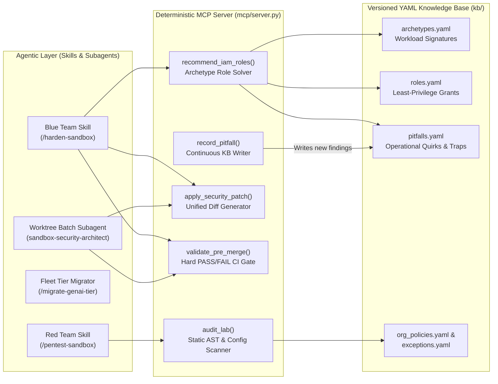

# Agentic Cloud & GenAI Sandbox Security (`cloud-sandbox-security`)

An end-to-end **Agentic Security Engineering Suite** combining a **deterministic Python MCP server**, a **self-learning YAML knowledge base**, **adversarial Red/Blue security skills**, and a **Git worktree fleet orchestrator** for hardening ephemeral Google Cloud and Generative AI sandbox environments.

---

## Why This Architecture? (Deterministic Engine + Agentic Workflows)

Prompt-only security agents struggle in production infrastructure-as-code (IaC) repositories for three reasons:
1. **IAM Hallucinations**: LLMs frequently guess IAM role names or over-grant primitive roles (`roles/editor`, project-wide `roles/iam.serviceAccountUser`) when a service fails to boot.
2. **Cross-File Blind Spots**: An agent inspecting an environment manifest (`sandbox.yaml`) will miss an authoritative `google_project_iam_policy` or exported `google_service_account_key` buried in a secondary Terraform harness.
3. **Rubber-Stamping**: If the same prompt both writes a security patch and judges whether it is safe to merge, regressions slip through.

This project decouples **probabilistic agent reasoning** from **deterministic security verification**:



---

## Key Architectural Pillars

### 1. Zero-Dependency Stdlib MCP Server (`mcp/server.py` & `mcp/security_engine.py`)
Implements JSON-RPC 2.0 over `stdio` using only the Python standard library + PyYAML. Exposes **12 deterministic tools** that any MCP-compatible client (Claude Code, Gemini CLI, Cursor) can invoke:

| MCP Tool | Purpose |
| :--- | :--- |
| `recommend_iam_roles(lab_slug)` | Matches Terraform + manifest resources against `kb/archetypes.yaml` and computes the minimal IAM role set, roles to remove, and operational pitfalls. |
| `lookup_roles(archetype?, services?)` | Pre-design least-privilege role discovery before any code is written on disk. |
| `audit_lab(lab_slug)` | Deterministic security audit across `sandbox.yaml`, all Terraform directories (`tf/`, `setup/`, `cleanup/`), and markdown instructions. |
| `validate_pre_merge(lab_slug)` | Mandatory **PASS / FAIL** gate. Blocks any PR containing primitive roles, leftover dev IAM admin, missing egress firewalls, or exported GenAI SA keys. |
| `apply_security_patch(lab_slug, patch_type, dry_run)` | Generates unified diffs (`egress_firewall`, `disable_imds_v1`, `least_privilege_iam`, `runtime_yaml`) across all Terraform harnesses. |
| `explain_pitfall(topic?, lab_slug?)` | Queries known service edge cases (e.g., Compute default SA impersonation, missing SSH quartet, Cloud Run Gen2 staging buckets). |
| `record_pitfall(lab_slug, symptom, cause, fix)` | **Self-learning feedback loop**: When an agent discovers a new runtime IAM quirk during testing, it persists the root cause and minimal fix into `kb/pitfalls.yaml`. |
| `classify_lab(lab_slug)` | Identifies cloud workload archetypes and services used in an environment. |
| `get_fleet_status(repo_path?, filter?)` | Computes real-time catalog hardening telemetry (`hardened`, `partial`, `untouched`). |
| `get_backlog(repo_path?, limit?)` | Ranks unhardened sandboxes by composite vulnerability risk score, automatically skipping approved exceptions. |
| `check_exception(lab_slug)` | Checks `kb/exceptions.yaml` for approved security exemptions (e.g., intentional IAM CTF challenge environments). |
| `ping(message?)` | MCP transport health check. |

### 2. Real-World Cloud & GenAI Threat Models Enforced
The engine and rules (`rules/AGENTS.md`) protect ephemeral cloud sandboxes against five high-severity abuse classes:

1. **Control-Plane vs. Data-Plane Token Exfiltration (`SA_KEY_WITH_LLM_OR_BROAD_ROLE`)**:
   - **Why VPC Egress Firewalls Protect VM-Attached SAs**: When a `google_service_account` is attached to a GCE VM with IMDSv2 enforced (`disable-legacy-endpoints = "TRUE"`), short-lived OAuth tokens stay inside the VM metadata server (`169.254.169.254`). Outbound traffic must traverse `tf/secure_network.tf`.
   - **Why Exported JSON Keys Bypass VPC Firewalls 100%**: If Terraform mints a `google_service_account_key` on an SA with `roles/aiplatform.user` or `roles/editor` and exposes it to the user, an attacker can copy the JSON text out of their browser and call `https://aiplatform.googleapis.com` from an external server over the public Control Plane—bypassing VPC egress rules completely.
2. **Managed Web IDE Provisioner Exemption Abuse (`MANAGED_IDE_ON_GENAI_TIER`)**:
   - Folder-level IAM Deny policies blocking `iam.serviceAccountKeys.create` often exempt control-plane orchestrator accounts (`ide-provisioner@`) that spin up browser-based Web IDE containers. If those containers mount static `/home/user/keys.json` credentials, pairing them with a `genai_sandbox` policy tier enables 1-click LLM API key theft.
3. **Project-Wide Service Account Impersonation (`CRITICAL_ROLE_SA_ADMIN` / `SA_USER`)**:
   - Grants of `roles/iam.serviceAccountUser` at the project level allow an untrusted user to attach the default Compute Engine Service Account (which often holds broad editor privileges) to a new VM. The engine enforces scoping `google_service_account_iam_member` strictly to custom, least-privilege service accounts in Terraform.
4. **Deceptive Authoritative Policy Overrides (`TF_AUTHORITATIVE_IAM_POLICY`)**:
   - Detects when `sandbox.yaml` looks clean on the surface while a Terraform file quietly applies `google_project_iam_policy` or `google_project_iam_binding` granting shadow privileges or stripping platform orchestrator accounts.
5. **Multi-Harness Egress Isolation (`tf/secure_network.tf`)**:
   - Enforces priority-`900` allow rules (`TCP:80,443`, `UDP/TCP:53`, `UDP:123`) paired with a priority-`1000` `0.0.0.0/0` deny-all egress firewall across every Terraform directory in the environment bundle.

---

## Quick Start & Running the Demo Suite

### 1. Run the Self-Contained Verification Suite
This repository includes 4 runnable demo environments under [`examples/sandboxes/`](examples/sandboxes/) (`overprivileged-vertex-agent`, `managed-ide-key-leak`, `hardened-cloud-run-reference`, and `iam-ctf-privilege-escalation-challenge`) and a 12-test integration suite that boots `mcp/server.py` over JSON-RPC stdio:

```bash
python3 -m unittest mcp/test_server.py -v
```

### 2. Connect to Claude Code, Gemini CLI, or Cursor

#### Claude Code
```bash
claude mcp add cloud_sandbox_security -- python3 "$(pwd)/mcp/server.py"
```

#### Gemini CLI / Workspace Plugin
```bash
mkdir -p ~/.gemini/config/plugins
ln -sfn "$(pwd)" ~/.gemini/config/plugins/cloud-sandbox-security
```

#### Cursor (`.cursor/mcp.json`)
Copy [`mcp_config.json`](mcp_config.json) to `.cursor/mcp.json` in your workspace root.

### 3. Try the Skills on the Included Vulnerable Examples

| Goal | Prompt / Slash Command | What Happens |
| :--- | :--- | :--- |
| **Red-Team Audit a Vulnerable Vertex AI Sandbox** | `/pentest-sandbox overprivileged-vertex-agent` | Calls `audit_lab`, flags `roles/editor`, leftover `projectIamAdmin`, missing `secure_network.tf`, and generates a live PoC verification plan. |
| **Detect Web IDE Key Exfiltration on GenAI Tier** | `/pentest-sandbox managed-ide-key-leak` | Triggers `MANAGED_IDE_ON_GENAI_TIER` and `SA_KEY_WITH_LLM_OR_BROAD_ROLE` critical blocks. |
| **Auto-Harden & Verify Pre-Merge Gate** | `/harden-sandbox overprivileged-vertex-agent` | Solves minimal IAM roles via `recommend_iam_roles`, applies `egress_firewall` + `least_privilege_iam` patches, and verifies `validate_pre_merge == PASS`. |
| **Verify Gold-Standard Hardened Environment** | *"Run `validate_pre_merge` on `hardened-cloud-run-reference`"* | Returns `status: PASS` with `0` blocking violations. |

---

## Repository Structure

```text
.
├── plugin.json                # Plugin manifest
├── mcp_config.json            # MCP stdio server configuration
├── mcp/
│   ├── server.py              # Zero-dependency JSON-RPC 2.0 MCP server (12 tools)
│   ├── security_engine.py     # Deterministic AST/config scanner, role solver, & patch engine
│   └── test_server.py         # End-to-end JSON-RPC integration test suite
├── kb/
│   ├── archetypes.yaml        # Cloud & GenAI workload detection signatures
│   ├── roles.yaml             # Least-privilege IAM role catalog & risk levels
│   ├── pitfalls.yaml          # Self-learning registry of service quirks & IAM traps
│   ├── org_policies.yaml      # Organization-level guardrails & quota baselines
│   └── exceptions.yaml        # Approved exemptions (e.g., IAM CTF challenge environments)
├── skills/
│   ├── harden-sandbox/        # Blue Team remediation workflow (SKILL.md)
│   ├── pentest-sandbox/       # Red Team audit & PoC verification workflow (SKILL.md)
│   └── migrate-genai-tier/    # Fleet GenAI policy tier migration & SA key auditor
├── agents/
│   └── sandbox-security-architect.md # Autonomous subagent for fleet-wide batch hardening
├── rules/
│   └── AGENTS.md              # Always-on security invariants for AI coding assistants
├── assets/
│   ├── secure_network.tf.template
│   ├── disable_imds_v1.tf.template
│   ├── private_subnet_nat.tf.template
│   ├── pre_provisioned_sa_key.tf.template
│   └── platform_ideas/        # Reference HCL for GKE Workload Identity & VPC-SC lockdown
├── scripts/
│   ├── orchestrate_hardening.py # Git worktree-isolated parallel batch orchestrator
│   └── record_pitfall.py      # CLI utility to append operational discoveries to kb/pitfalls.yaml
└── examples/
    └── sandboxes/             # 4 runnable demo environments (vulnerable & hardened references)
```
