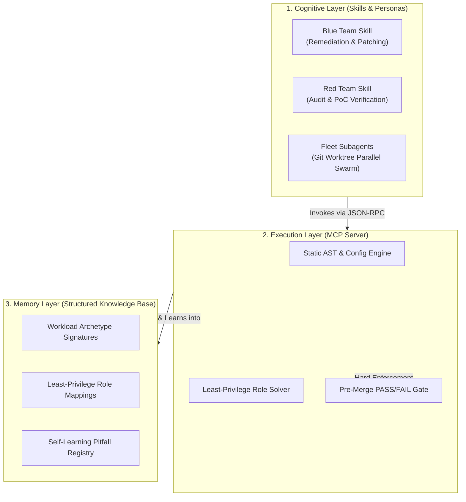

# Agentic AI Systems & Cloud Security (`agentic`)

A production portfolio of **Agentic AI Systems, MCP Servers, and Automated Cloud Security Architectures** by Zach Noah.

[](https://modelcontextprotocol.io/)
[]()
[-orange.svg)]()
[]()

---

## 🏛️ Architectural Philosophy: Solving the 3 Flaws of AI Agents

Most AI agent systems in production suffer from three structural failures:
1. **Hallucination & Over-Privilege**: LLMs guess IAM role names and over-grant primitive permissions (`roles/editor`, `AdministratorAccess`) when a deployment fails.
2. **Cross-File Blind Spots**: An agent inspecting a high-level manifest misses authoritative policies or exportable credential keys buried in nested infrastructure-as-code (IaC) harnesses.
3. **Rubber-Stamping**: When the same prompt writes a security patch and self-certifies that it is safe to merge, critical regressions pass unnoticed.

### The Solution: Decoupled Agentic Architecture
This repository implements a **decoupled, multi-layered architecture** that separates probabilistic reasoning from deterministic verification:



---

## 📦 Plugins & Systems Catalog

Each system in this repository is completely self-contained in `plugins/` with its own test suite, deterministic engine, and agent workflows:

| Plugin | Cloud Provider | Core Capabilities | Status |
| :--- | :--- | :--- | :--- |
| [**`gcp-sandbox-security`**](plugins/gcp-sandbox-security/) | **Google Cloud & Vertex AI** | Deterministic MCP server (12 tools), self-learning YAML knowledge base, least-privilege IAM solver, IMDSv2 enforcement, VPC egress lockdown, Web IDE key exfiltration blocking, and 4 runnable demo sandboxes. | 🟢 **Live & Verified** (12/12 Tests Passing) |
| [**`aws-sandbox-security`**](plugins/aws-sandbox-security/) | **AWS & Amazon Bedrock** *(Roadmap)* | AWS IAM least-privilege analyzer, Service Control Policies (SCPs), IMDSv2 enforcement, STS token theft mitigation, Amazon Bedrock sandbox isolation, and VPC Endpoint egress lockdown. | 🟡 **In Development** |

---

## ⚡ 10-Second Quickstart

You do **not** need an active AI agent or API keys to test any system. Run the included vulnerable sandbox audit directly from the command line:

```bash
# Clone the repository
git clone https://github.com/zachnoah89/agentic.git
cd agentic

# Run the GCP Sandbox Security Suite demo
cd plugins/gcp-sandbox-security
./install.sh
```

### Run Instant CLI Audits
```bash
# Audit an overprivileged Vertex AI & Compute Engine sandbox:
python3 mcp/server.py audit examples/sandboxes/overprivileged-vertex-agent

# Run pre-merge validation gate on a hardened reference sandbox:
python3 mcp/server.py validate examples/sandboxes/hardened-cloud-run-reference

# Compute minimal IAM roles and operational gotchas:
python3 mcp/server.py recommend examples/sandboxes/overprivileged-vertex-agent
```

---

## 🤖 Universal AI Agent Integration

All plugins expose native **Model Context Protocol (MCP)** servers over JSON-RPC 2.0 stdio, compatible with **Claude Code**, **Gemini CLI**, and **Cursor**:

### Claude Code
```bash
claude mcp add gcp_sandbox_security -- python3 "$(pwd)/plugins/gcp-sandbox-security/mcp/server.py" serve
```

### Cursor / Windsurf
A root [`.cursor/mcp.json`](.cursor/mcp.json) is pre-configured. Open this repository root in Cursor, and the MCP tools are registered automatically.

### Gemini CLI
```bash
mkdir -p ~/.gemini/config/plugins
ln -sfn "$(pwd)/plugins/gcp-sandbox-security" ~/.gemini/config/plugins/gcp-sandbox-security
```

---

## 📂 Repository Layout

```text
agentic/
├── README.md                          # Portfolio Overview & Architecture Hub
├── .cursor/
│   └── mcp.json                       # Global Cursor MCP registration
│
└── plugins/
    ├── gcp-sandbox-security/          # Google Cloud & Vertex AI Security Suite
    │   ├── README.md                  # Deep-Dive GCP Security Documentation
    │   ├── pyproject.toml             # Standalone Python packaging
    │   ├── install.sh                 # Fast installer & verification test runner
    │   ├── mcp/                       # MCP Server & Deterministic AST Engine
    │   ├── kb/                        # Self-Learning YAML Knowledge Base
    │   ├── skills/                    # Red/Blue Team Agent Skills
    │   ├── agents/                    # Autonomous Worktree Fleet Subagents
    │   ├── rules/                     # AGENTS.md Invariant Guardrails
    │   ├── assets/                    # Hardened Terraform HCL Templates
    │   └── examples/sandboxes/        # 4 Runnable Vulnerable & Hardened Sandboxes
    │
    └── aws-sandbox-security/          # AWS & Bedrock Security Suite (Roadmap)
```
