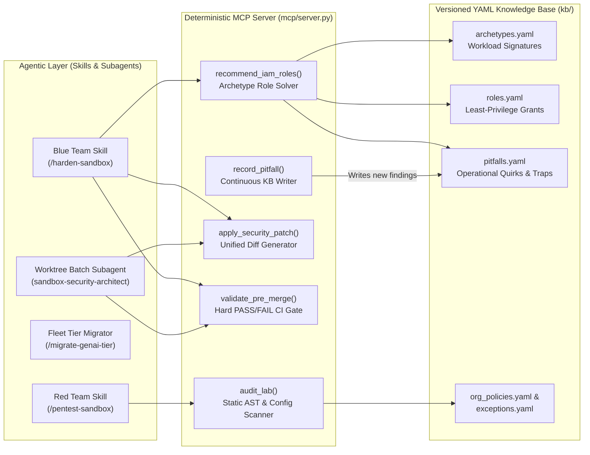

# Agentic Cloud & GenAI Sandbox Security (`cloud-sandbox-security`)

An end-to-end **Agentic Security Engineering Suite** combining a **deterministic Python MCP server**, a **self-learning YAML knowledge base**, **adversarial Red/Blue security skills**, and a **Git worktree fleet orchestrator** for hardening ephemeral Google Cloud and Generative AI sandbox environments.

[](https://www.python.org/)
[](https://modelcontextprotocol.io/)
[]()
[]()

---

## ⚡ Quick 5-Second Demo (No AI or API Keys Required)

You do **not** need a running LLM, API credentials, or an agent client to see the deterministic security engine work. Clone and run the included vulnerable sandbox audit in 5 seconds:

```bash
git clone https://github.com/zachnoah89/agentic.git
cd agentic
./install.sh
```

Or run the CLI directly against the included demo sandboxes:

```bash
# 1. Audit a vulnerable Vertex AI & GCE sandbox:
python3 mcp/server.py audit examples/sandboxes/overprivileged-vertex-agent

# 2. Check the pre-merge gate on a hardened reference sandbox:
python3 mcp/server.py validate examples/sandboxes/hardened-cloud-run-reference

# 3. Compute least-privilege IAM roles and operational traps:
python3 mcp/server.py recommend examples/sandboxes/overprivileged-vertex-agent
```

### Example Audit Output

```text
======================================================================
 🛡️  CLOUD SANDBOX SECURITY AUDIT: overprivileged-vertex-agent
======================================================================
 Summary: 6 Findings (CRITICAL: 3 | HIGH: 0 | WARNING: 1 | INFO: 2)

 1. [CRITICAL] CRITICAL_ROLE_EDITOR (sandbox.yaml)
    Message:     Grants 'roles/editor' to user (user_0).
    Remediation: Replace with scoped minimal roles from recommend_iam_roles.

 2. [CRITICAL] DEV_ADMIN_PRESENT (sandbox.yaml)
    Message:     Temporary development permission 'roles/resourcemanager.projectIamAdmin' is present.
    Remediation: Remove before merging to production.

 3. [CRITICAL] MISSING_RUNTIME_YAML (tf/runtime.yaml)
    Message:     Missing 'runtime.yaml' in Terraform directory 'tf'. The Cloud Sandbox Platform script runner requires runtime.yaml declaring 'runtime: terraform' and 'version: 1.12.1'. Omitting it causes lab launch to fail immediately with 'bad request, invalid script: missing runtime.yaml file' (SEC-004).
    Remediation: Create runtime.yaml declaring 'runtime: terraform' and 'version: 1.12.1'.

 4. [WARNING]  MISSING_EGRESS_FIREWALL (tf/secure_network.tf)
    Message:     No network egress restrictions found (secure_network.tf missing).
    Remediation: Apply egress_firewall patch to block unauthorized egress ports.
```

---

## Why This Architecture? (Deterministic Engine + Agentic Workflows)

Prompt-only security agents struggle in production infrastructure-as-code (IaC) repositories for three reasons:
1. **IAM Hallucinations**: LLMs frequently guess IAM role names or over-grant primitive roles (`roles/editor`, project-wide `roles/iam.serviceAccountUser`) when a service fails to boot.
2. **Cross-File Blind Spots**: An agent inspecting an environment manifest (`sandbox.yaml`) will miss an authoritative `google_project_iam_policy` or exported `google_service_account_key` buried in a secondary Terraform harness.
3. **Rubber-Stamping**: If the same prompt both writes a security patch and judges whether it is safe to merge, regressions slip through.

This project decouples **probabilistic agent reasoning** from **deterministic security verification**:



---

## Dual-Mode Design: CLI for Humans + MCP for AI Agents

The suite operates in two complementary modes:

### Mode 1: Standalone Developer CLI (Local & CI/CD)
Installable via `pip install -e .` to provide the `cloud-sandbox-security` CLI for pre-commit hooks, local developer testing, and GitHub Actions CI pipelines:
* `cloud-sandbox-security audit <path>`
* `cloud-sandbox-security validate <path>`
* `cloud-sandbox-security recommend <path>`
* `cloud-sandbox-security test`

### Mode 2: JSON-RPC 2.0 MCP Server (AI Agents)
When invoked by an AI coding assistant (or via `cloud-sandbox-security serve`), it boots a zero-dependency stdio server exposing **12 deterministic tools**:

| MCP Tool | Purpose |
| :--- | :--- |
| `recommend_iam_roles(lab_slug)` | Matches Terraform + manifest resources against `kb/archetypes.yaml` and computes the minimal IAM role set, roles to remove, and operational pitfalls. |
| `lookup_roles(archetype?, services?)` | Pre-design least-privilege role discovery before any code is written on disk. |
| `audit_lab(lab_slug)` | Deterministic security audit across `sandbox.yaml`, all Terraform directories (`tf/`, `setup/`, `cleanup/`), and markdown instructions. |
| `validate_pre_merge(lab_slug)` | Mandatory **PASS / FAIL** gate. Blocks any PR containing primitive roles, leftover dev IAM admin, missing egress firewalls, or exported GenAI SA keys. |
| `apply_security_patch(lab_slug, patch_type, dry_run)` | Generates unified diffs (`egress_firewall`, `disable_imds_v1`, `least_privilege_iam`, `runtime_yaml`) across all Terraform harnesses. |
| `explain_pitfall(topic?, lab_slug?)` | Queries known service edge cases (e.g., Compute default SA impersonation, missing SSH quartet, Cloud Run Gen2 staging buckets). |
| `record_pitfall(lab_slug, symptom, cause, fix)` | **Self-learning feedback loop**: When an agent discovers a new runtime IAM quirk during testing, it persists the root cause and minimal fix into `kb/pitfalls.yaml`. |
| `classify_lab(lab_slug)` | Identifies cloud workload archetypes and services used in an environment. |
| `get_fleet_status(repo_path?, filter?)` | Computes real-time catalog hardening telemetry (`hardened`, `partial`, `untouched`). |
| `get_backlog(repo_path?, limit?)` | Ranks unhardened sandboxes by composite vulnerability risk score, automatically skipping approved exceptions. |
| `check_exception(lab_slug)` | Checks `kb/exceptions.yaml` for approved security exemptions (e.g., intentional IAM CTF challenge environments). |
| `ping(message?)` | MCP transport health check. |

---

## Real-World Cloud & GenAI Threat Models Enforced

The engine and rules ([`rules/AGENTS.md`](rules/AGENTS.md)) protect ephemeral cloud sandboxes against five high-severity abuse classes:

1. **Control-Plane vs. Data-Plane Token Exfiltration (`SA_KEY_WITH_LLM_OR_BROAD_ROLE`)**:
   - **Why VPC Egress Firewalls Protect VM-Attached SAs**: When a `google_service_account` is attached to a GCE VM with IMDSv2 enforced (`disable-legacy-endpoints = "TRUE"`), short-lived OAuth tokens stay inside the VM metadata server (`169.254.169.254`). Outbound traffic must traverse `tf/secure_network.tf`.
   - **Why Exported JSON Keys Bypass VPC Firewalls 100%**: If Terraform mints a `google_service_account_key` on an SA with `roles/aiplatform.user` or `roles/editor` and exposes it to the user, an attacker can copy the JSON text out of their browser and call `https://aiplatform.googleapis.com` from an external server over the public Control Plane—bypassing VPC egress rules completely.
2. **Managed Web IDE Provisioner Exemption Abuse (`MANAGED_IDE_ON_GENAI_TIER`)**:
   - Folder-level IAM Deny policies blocking `iam.serviceAccountKeys.create` often exempt control-plane orchestrator accounts (`ide-provisioner@`) that spin up browser-based Web IDE containers. If those containers mount static `/home/user/keys.json` credentials, pairing them with a `genai_sandbox` policy tier enables 1-click LLM API key theft.
3. **Project-Wide Service Account Impersonation (`CRITICAL_ROLE_SA_ADMIN` / `SA_USER`)**:
   - Grants of `roles/iam.serviceAccountUser` at the project level allow an untrusted user to attach the default Compute Engine Service Account (which often holds broad editor privileges) to a new VM. The engine enforces scoping `google_service_account_iam_member` strictly to custom, least-privilege service accounts in Terraform.
4. **Deceptive Authoritative Policy Overrides (`TF_AUTHORITATIVE_IAM_POLICY`)**:
   - Detects when `sandbox.yaml` looks clean on the surface while a Terraform file quietly applies `google_project_iam_policy` or `google_project_iam_binding` granting shadow privileges or stripping platform orchestrator accounts.
5. **Multi-Harness Egress Isolation (`tf/secure_network.tf`)**:
   - Enforces priority-`900` allow rules (`TCP:80,443`, `UDP/TCP:53`, `UDP:123`) paired with a priority-`1000` `0.0.0.0/0` deny-all egress firewall across every Terraform directory in the environment bundle.

---

## Agent Client Setup (Claude Code, Gemini CLI, Cursor)

### Claude Code
```bash
claude mcp add cloud_sandbox_security -- python3 "$(pwd)/mcp/server.py" serve
```

### Cursor / Windsurf
This repository includes a pre-configured [`.cursor/mcp.json`](.cursor/mcp.json). Simply open this folder in Cursor and the MCP server is automatically recognized.

### Gemini CLI
```bash
mkdir -p ~/.gemini/config/plugins
ln -sfn "$(pwd)" ~/.gemini/config/plugins/cloud-sandbox-security
```

---

## Included Demo Sandboxes ([`examples/sandboxes/`](examples/sandboxes/))

| Sandbox Slug | Features & Threat Models | Pre-Merge Status |
| :--- | :--- | :--- |
| `overprivileged-vertex-agent` | Vertex AI Gemini + BigQuery + GCE VM with `roles/editor`, leftover `projectIamAdmin`, missing runtime.yaml, and no egress firewall. | ❌ `FAIL` (3 Criticals) |
| `managed-ide-key-leak` | Pairs a Managed Web IDE container mounting static keys with `policy_tier: genai_sandbox`, minting an exported `google_service_account_key` on `roles/aiplatform.user`. | ❌ `FAIL` (Exfiltration Block) |
| `hardened-cloud-run-reference` | Gold-standard reference environment: Scoped minimal IAM (`roles/run.admin`, `roles/storage.admin`, `roles/viewer`), `tf/secure_network.tf` egress firewall, `tf/runtime.yaml`, and IMDSv2. | ✅ `PASS` (0 Violations) |
| `iam-ctf-privilege-escalation-challenge` | Intentional security challenge sandbox registered in [`kb/exceptions.yaml`](kb/exceptions.yaml). | ✅ `PASS_WITH_EXCEPTION` |

---

## Repository Structure

```text
.
├── pyproject.toml             # Standard PEP 517/621 packaging & CLI entrypoint
├── install.sh                 # Zero-friction multi-client installer & test runner
├── plugin.json                # Plugin metadata manifest
├── mcp_config.json            # MCP stdio server configuration
├── .cursor/
│   └── mcp.json               # Cursor IDE auto-discovery configuration
├── mcp/
│   ├── server.py              # Dual-mode CLI & JSON-RPC 2.0 MCP server (12 tools)
│   ├── security_engine.py     # Deterministic AST/config scanner, role solver, & patch engine
│   └── test_server.py         # End-to-end integration test suite (12 tests)
├── kb/
│   ├── archetypes.yaml        # Cloud & GenAI workload detection signatures
│   ├── roles.yaml             # Least-privilege IAM role catalog & risk levels
│   ├── pitfalls.yaml          # Self-learning registry of service quirks & IAM traps
│   ├── org_policies.yaml      # Organization-level guardrails & quota baselines
│   └── exceptions.yaml        # Approved exemptions (e.g., IAM CTF challenge environments)
├── skills/
│   ├── harden-sandbox/        # Blue Team remediation workflow (SKILL.md)
│   ├── pentest-sandbox/       # Red Team audit & PoC verification workflow (SKILL.md)
│   └── migrate-genai-tier/    # Fleet GenAI policy tier migration & SA key auditor
├── agents/
│   └── sandbox-security-architect.md # Autonomous subagent for fleet-wide batch hardening
├── rules/
│   └── AGENTS.md              # Always-on security invariants for AI coding assistants
├── assets/
│   ├── secure_network.tf.template
│   ├── disable_imds_v1.tf.template
│   ├── private_subnet_nat.tf.template
│   ├── pre_provisioned_sa_key.tf.template
│   └── platform_ideas/        # Reference HCL for GKE Workload Identity & VPC-SC lockdown
├── scripts/
│   ├── orchestrate_hardening.py # Git worktree-isolated parallel batch orchestrator
│   └── record_pitfall.py      # CLI utility to append operational discoveries to kb/pitfalls.yaml
└── examples/
    └── sandboxes/             # 4 runnable demo environments (vulnerable & hardened references)
```
