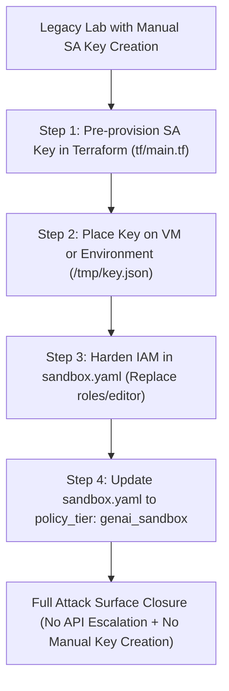

# Service Account Key Remediation & Lateral Abuse Prevention Guide

This reference documents the security architecture, threat model, and standard remediation pattern for labs that historically instructed learners to create manual Service Account keys (`gcloud iam service-accounts keys create`).

---

## 1. Threat Model & Lateral Abuse Vector

In default/legacy Cloud Sandbox Platform environments:
1. **Implicit `roles/editor` Grant**: When `roles:` is omitted or left empty on `type: gcp_user`, Navy defaults to granting the learner `roles/editor` on the temporary GCP project.
2. **Lateral API Escalation**: Because `roles/editor` includes `serviceusage.services.enable`, a bad actor can start a non-LLM lab on `variant: standard_sandbox` (which bypasses the first-time LLM reCAPTCHA) and enable high-cost APIs:
   ```bash
   gcloud services enable aiplatform.googleapis.com
   ```
3. **Key Exfiltration**: The bad actor runs `gcloud iam service-accounts keys create key.json`, exfiltrates the key off-platform, and runs external scraping/LLM bots against Google Cloud on Cloud Sandbox Platform-funded billing.

---

## 2. The 4-Step Remediation Pattern

To close this attack surface while allowing labs requiring Service Account credentials to function without breaking, follow this standard pattern:



---

### Step 1: Pre-Provision SA Key in Terraform (`tf/main.tf`)

Because Navy's backend infrastructure service accounts (`ide_provisioner`, `gke-services-cluster`) are allowlisted to bypass the `genai_sandbox` folder's `iam.disableServiceAccountKeyCreation` Deny policy, Terraform can safely create keys during lab startup:

```hcl
# Create dedicated Service Account
resource "google_service_account" "app_sa" {
  account_id   = "app-service-account"
  display_name = "Application Service Account"
  project      = var.project_id
}

# Pre-provision JSON key via Terraform
resource "google_service_account_key" "app_sa_key" {
  service_account_id = google_service_account.app_sa.name
}

# Deliver key to student VM or cloud storage
resource "local_file" "sa_credentials" {
  content  = base64decode(google_service_account_key.app_sa_key.private_key)
  filename = "/home/student/credentials/key.json"
}
```

---

### Step 2: Harden IAM Roles in `sandbox.yaml`

Strip `roles/editor` and assign scoped service roles along with `roles/serviceusage.serviceUsageConsumer` (which allows using pre-enabled APIs but **denies enabling new APIs** like `aiplatform.googleapis.com`):

```yaml
environment:
  resources:
    - type: gcp_project
      id: project_0
      policy_tier: genai_sandbox

    - type: gcp_user
      id: user_0
      roles:
        - roles/viewer
        - roles/serviceusage.serviceUsageConsumer
        - roles/documentai.viewer  # Scoped to lab need
        - roles/storage.objectAdmin
```

---

### Step 3: Update Student Instructions (`instructions/en.md`)

Remove manual key generation commands:
```bash
# ❌ REMOVE from student instructions:
gcloud iam service-accounts keys create ~/key.json --iam-account=...
```

Replace with references to the pre-provisioned key:
```bash
# ✅ REPLACE WITH:
export GOOGLE_APPLICATION_CREDENTIALS="/home/student/credentials/key.json"
```

---

## 3. Inventory of Affected Catalog Labs Requiring Remediation

The following 23 catalog labs were identified during the fleet audit as containing manual SA key creation and should be remediated using the pattern above during Phase 2 of Lab Hardening:

1. `sandbox-demo-deploying-a-python-flask-web-application-to-app-engine-flexible`
2. `sandbox-demo-classify-text-into-categories-with-the-natural-language-api`
3. `sandbox-demo-cloud-natural-language-api-qwik-start`
4. `sandbox-demo-creating-dynamic-secrets-with-vault`
5. `sandbox-demo-ocr-with-document-ai-python`
6. `sandbox-demo-analyzing-findings-with-security-command-center`
7. `sandbox-demo-video-intelligence-qwik-start`
8. `sandbox-demo-it-speaks-create-synthetic-speech-using-cloud-text-to-speech`
9. `sandbox-demo-cloud-eng-challenge-lab`
10. `sandbox-demo-hardening-default-gke-cluster-configurations`
11. `sandbox-demo-AWS-cloud-eng-challenge-lab`
12. `sandbox-demo-azure-cloud-eng-challenge-lab`
13. `sandbox-demo-online-data-migration-spanner-striim`
14. `sandbox-demo-managing-a-gke-multi-tenant-cluster-with-namespaces`
15. `sandbox-demo-splunk-gdi-for-gcp`
16. `sandbox-demo-online-data-migration-bigquery-striim`
17. `sandbox-demo-connect-gke-app-to-cloudsql-for-postgresql`
18. `sandbox-demo-create-a-procurement-document-parser`
19. `sandbox-demo-deploying-redis-enterprise-for-gke-and-serverless-app-on-anthos-bm-on-gce`
20. `sandbox-demo-using-elastic-stack-to-monitor-google-cloud`
21. `mini-lab-63`
22. `sbh107-remediate-compromised-cloud-security-resources`
23. `sbh108-remediate-cloud-security-risks`
